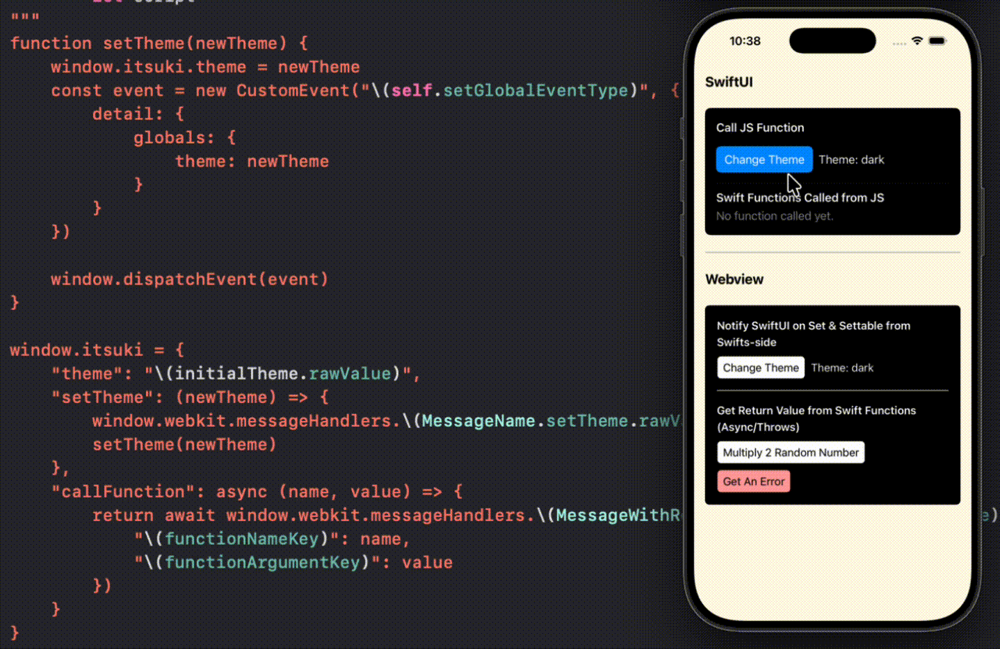

# SwiftUI: Webview ↔ JavaScript Two-Way Communication Demo

A demo of Two way communication between webview and Javascript achieved with a custom Global Object (JS) and WKUserContentController.

Specifically, this demo includes 
1. Notify Swift App from JS
2. Get a response from Swift Function (async throws) from JS
3. Call JS function from Swift and update UI on the Web

For more details, please refer to my article [SwiftUI:  Webview ↔ JavaScript. Two-Way Communication.]()


## Run the App
1. Start the web server 

```bash
cd web
npm run dev
```

2. Run the SwiftUI App



